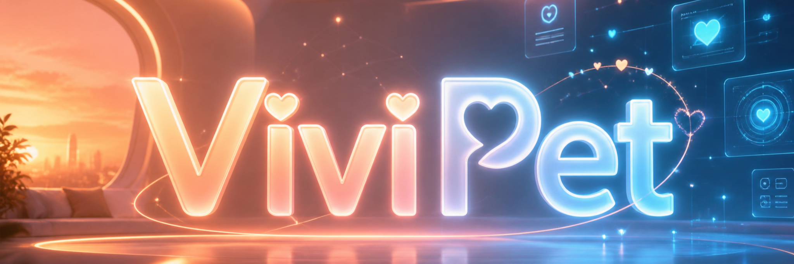

<div align="center">
  <picture>
    <source media="(prefers-color-scheme: dark)" srcset="https://raw.githubusercontent.com/suntianc/ViviPet/main/apps/desktop/assets/icon.png">
    
  </picture>
  <h1 align="center">ViviPet</h1>
  <p align="center"><strong>AI-driven Live2D Desktop Companion</strong></p>
  <p align="center">
    <code>Give your AI Agent a Live2D body</code>
  </p>

  <p align="center">
    <a href="https://github.com/suntianc/ViviPet/releases">
      
    </a>
    <a href="https://github.com/suntianc/ViviPet/blob/main/LICENSE">
      
    </a>
    <a href="https://github.com/suntianc/ViviPet/stargazers">
      
    </a>
    <a href="https://github.com/suntianc/ViviPet/actions">
      
    </a>
    <a href="https://github.com/suntianc/ViviPet/issues">
      
    </a>
  </p>
</div>

<br />

<p align="center">
    <a href="#-features">English</a> |
    <a href="source/docs/README_ZH.md">简体中文</a>
</p>

> **ViviPet** gives your AI agent a visible, expressive Live2D body on the desktop — triggered by a simple action API. Every thought, speech, and emotion becomes a lively visual and audio response.

---

## 🎬 Demo

https://github.com/suntianc/ViviPet/blob/main/source/video/show.mp4

---

## Features

<div align="center">

| Feature | Description |
|---|---|
| **Rich Expression System** | Powered by Live2D Cubism 5 — thinking, speaking, happy, confused, angry, and more |
| **External Agent API** | HTTP event bridge (`:18765`) — any agent can control the pet with `curl` |
| **Multi-Source TTS** | System TTS (macOS `say`) · Local service · Cloud API |
| **Mouse Awareness** | Eyes follow your cursor — it always knows where you're looking |
| **Custom Model Support** | Import your own Live2D models via the tray menu |
| **Lightweight** | Frameless, transparent, always-on-top — sits quietly in the corner |
| **Flexible Integration** | HTTP event bridge · Electron IPC — bring your own agent |

</div>

---

### HTTP Event Bridge

```
POST http://localhost:18765/event   → Dispatch an action with speech
GET  http://localhost:18765/actions → List available actions
GET  http://localhost:18765/health  → Health check
```

```bash
# No-code trigger from any agent
curl -X POST http://localhost:18765/event \
  -H "Content-Type: application/json" \
  -d '{
    "type":"happy",
    "text":"Task complete, go check it out~",
    "tts":{
      "model": "instruct",
      "instruct": "A cute, playful girl voice with high pitch"
    }
  }'
```

### Integration Examples

<details>
<summary><b>Hermes Agent Integration</b></summary>

```markdown
Coming soon...
```

</details>

<details>
<summary><b>Claude Code / Cursor Integration</b></summary>

```markdown
Coming soon...
```

</details>

---

## TTS (Text-to-Speech) System

ViviPet features a flexible TTS system with **three provider types** and **three request modes**.

| Type | Description | Config |
|:--------:|-------------|--------|
| `system` | macOS `say` command | Voice selection, rate control |
| `local` | Self-hosted TTS service | Custom endpoint URL, audio format |
| `cloud` | OpenAI / ElevenLabs / Azure | API key, voice, model selection |

### Local Request Modes

| Mode | Purpose | Example |
|:----:|---------|---------|
| `preset` | Use a predefined voice | `{ "text": "Hello", "voice": "nova", "model": "preset" }` |
| `clone` | Voice cloning | `{ "text": "Hello", "model": "clone" }` |
| `instruct` | Style instruction | `{ "text": "Hello", "instruct": "Whisper softly", "model": "instruct" }` |

- Clone mode requires reference audio pre-configured in your TTS service
- Tested with models: Qwen3-TTS-12Hz-1.7B-Base-8bit, Qwen3-TTS-12Hz-1.7B-CustomVoice-8bit, Qwen3-TTS-12Hz-1.7B-VoiceDesign-8bit
- Sample TTS server: `[tts_server_example/api_tts.py](source/example/tts_server_example/api_tts.py)`

---

## Adding a Live2D Model (feature not fully tested)

1. **Prepare** a Live2D Cubism 5 model (`.model3.json`, `.moc3`, textures, physics, motions) and package it as a zip
2. **Import** via the tray menu → Import Model

> Full model integration spec: [specification/live2d-model-integration-spec.md](source/docs/specification/live2d-model-integration-spec.md)

---

## 🤝 Contributing

All contributions are welcome! Whether it's:

- **New Live2D models** — Share your character creations
- **Bug fixes** — Found an issue? Open a PR
- **Feature ideas** — New actions, integrations, or TTS providers
- **Documentation** — Help others get started

Feel free to submit a [Pull Request](https://github.com/suntianc/ViviPet/pulls) or [open an Issue](https://github.com/suntianc/ViviPet/issues).

---

## 📄 License

[GNU General Public License v3.0](LICENSE) — see the [LICENSE](LICENSE) file for details.

---

## Acknowledgements

Special thanks to **@bailyovo** for providing free Live2D models. Visit her <a href="https://bailyovo.booth.pm">Booth store</a>.

<div align="center">
  <p>
    <sub>
      Made with 💖 and Live2D Cubism 5 ·
      <a href="https://www.live2d.com/">Live2D Inc.</a>
    </sub>
  </p>
  <p>
    <sub>Built with Electron · React · TypeScript · Vite · WebGL</sub>
  </p>
  <br />
  <p>
    <a href="https://github.com/suntianc/ViviPet">
      
    </a>
    <a href="https://github.com/suntianc/ViviPet/fork">
      
    </a>
  </p>
</div>
